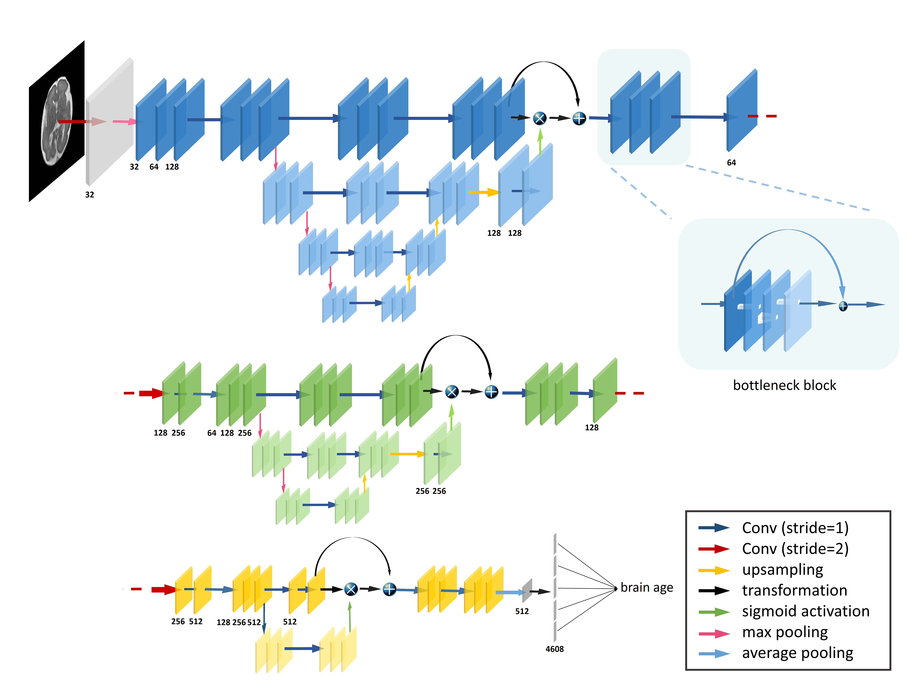

## Attention-based Deep Ensembles for Fetal Brain Age Estimation  
This repository contains the relevant core demo for fetal brain age estimation and anomaly detection based on the center slice using deep ensembles with uncertainty. 

### Network Architecture


### Prerequisite (Implementation)
* **Python 3.6**
* **Tensorflow >=1.10.0**
* **Keras >=2.2.4**

### Usage
To train the network, make sure you have the following files serialized using **pickle** and located in the path below. The default shape of our network input is (N_subject,192,192,1) while output shape is (N_subject,). Or just revise the code wherever you want to fit your data format. 
```
./data/train_data.p
./data/train_label.p
./data/validation_data.p
./data/validation_label.p
```
Please use the command below to train the network. The model will be automatically saved in the default path```./save_models/```. Search for an optimal learning rate and it won't take much time to train. 
```
python main.py --action train
```
To predict the fetal brain age based on the deep ensembles, please use the command below. The trained networks named as 'demo_0.h5', 'demo_1.h5', etc. are preferably loaded from  ```./models/``` .
```
python main.py --action predict
```
Use --help to see other usage of main.py.

### Citation
```
@article{SHI2020117316,
title = "Fetal brain age estimation and anomaly detection using attention-based deep ensembles with uncertainty",
journal = "NeuroImage",
volume = "223",
pages = "117316",
year = "2020",
issn = "1053-8119",
doi = "https://doi.org/10.1016/j.neuroimage.2020.117316",
url = "http://www.sciencedirect.com/science/article/pii/S1053811920308028",
author = "Wen Shi and Guohui Yan and Yamin Li and Haotian Li and Tingting Liu and Cong Sun and Guangbin Wang and Yi Zhang and Yu Zou and Dan Wu"
}
```

### Contact
Please feel free to contact me or open an issue if you have any question.
E-mail: allard.w.shi at gmail.com